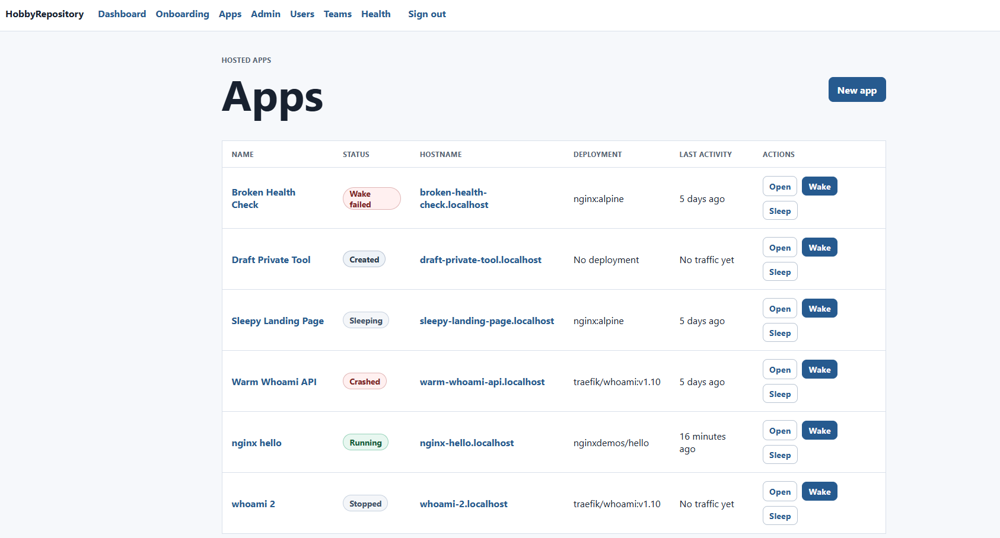
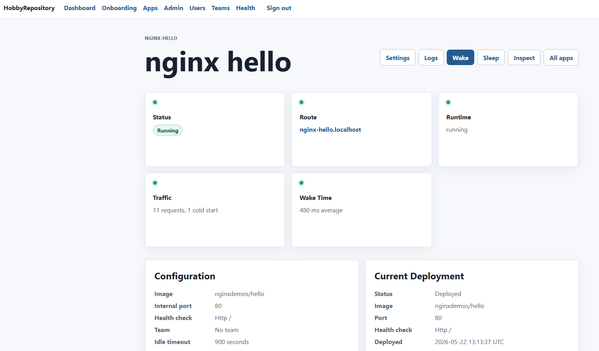

# HobbyRepository

HobbyRepository is a Rails-based control plane for hosting small containerized
hobby apps on a single machine. It manages app records, routes, deployments,
runtime state, logs, metrics, persistent resources, and sleep/wake lifecycle
coordination for HTTP containers.

The product goal is a local-first platform where small apps can sleep when idle
and wake automatically when traffic arrives.

## Current App

The repository now includes a working Rails dashboard and local runtime control
plane:

- Rails 8.1, PostgreSQL, Redis, Hotwire, Puma, Solid Queue, Solid Cache, and
  Solid Cable.
- Password-based authentication with seeded admin and sample users.
- Hosted app creation, listing, detail, and settings pages.
- App ownership through users, plus optional team assignment and admin views.
- App lifecycle states for `created`, `deploying`, `sleeping`, `waking`,
  `running`, `draining`, `stopping`, `stopped`, `crashed`, `unhealthy`, and
  `wake_failed`.
- Generated localhost-style routes and custom domain records with ownership and
  TLS status tracking.
- Image deployments, Git deployment records, deployment history, build logs, and
  rollback support.
- Manual wake, sleep, runtime inspect, redeploy, Git deploy, and rollback
  actions from the app detail page.
- Local Docker runtime agent boundary for start, stop, inspect, health checks,
  log capture, metrics, resource limits, volumes, and platform labels.
- Internal gateway API endpoints for hostname resolution, wake requests, wake
  status polling, and activity reporting.
- Local Rails gateway path for app hostnames during development.
- Environment variables with secret masking.
- Optional per-app persistent volumes.
- Optional shared database resource records, credential rotation, backup export,
  and database environment injection.
- Request metrics, runtime metric snapshots, cold start metrics, app logs, and
  app event timeline.
- Admin app overview, emergency stop action, user management, team management,
  and platform health page.
- Node heartbeat endpoint and explicit node capacity fields for future
  multi-node work.
- First app guide and a one-click sample `traefik/whoami:v1.10` app.

## Features

### Dashboard

The dashboard summarizes local platform status, recent apps, recent events,
running app count, and reserved memory. The apps area shows status, hostname,
current deployment, last activity, and quick wake/sleep actions.

### App Management

Each app stores its name, slug, image reference, internal port, health check
mode, idle timeout, startup timeout, sleep mode, memory limit, CPU limit, owner,
team, node, routes, deployments, runtime instances, logs, metrics, environment
variables, volume, and database resource.

The app detail page is the primary operations surface. It shows configuration,
current deployment, deployment history, routes, environment variables,
persistent storage, shared database, database backups, runtime instance,
request metrics, runtime metrics, cold starts, latest logs, and event timeline.

### Runtime Lifecycle

Apps can be woken and slept manually. Wake operations create runtime instances,
start containers through the runtime agent, prepare runtime environment values,
wait for HTTP or port readiness, collect startup metrics, and record events.
Sleep operations drain active activity, stop containers, update runtime state,
and record sleep events.

The local gateway can wake a sleeping app on an incoming hostname request and
returns a simple waking or failure page while the app is unavailable.

### Routing And Gateway

Generated routes use the configured platform base host. Custom domain records
track ownership verification, ownership token, active state, TLS status, and TLS
provisioning time.

Internal gateway endpoints are protected by a bearer token in shared or
production environments:

```text
GET  /internal/gateway/resolve
POST /internal/gateway/wake
GET  /internal/gateway/wake_status
POST /internal/gateway/activity
```

### Observability

The app records platform events, runtime logs, request metrics, runtime resource
snapshots, and cold start metrics. These are visible from the app detail and log
pages, and admin users can inspect platform health and recent failures.

### Seed Data

Database seeds create:

- Local node capacity.
- Admin user: `admin@example.com` / `password123`.
- Sample user: `user@example.com` / `password123`.
- Demo team.
- Demo apps covering sleeping, running, failed, and draft states.
- Example deployments, routes, logs, metrics, volumes, database resources, and
  backups.

Override seeded credentials with `SEED_USER_EMAIL`, `SEED_USER_PASSWORD`,
`SEED_SAMPLE_USER_EMAIL`, and `SEED_SAMPLE_USER_PASSWORD`.

## Screenshots

### Apps



### ExampleApp



## Architecture Direction

The MVP has two main parts:

- Control plane: Rails dashboard/API, app registry, deployments, routes, nodes,
  runtime state, events, logs, metrics, wake coordination, admin operations, and
  internal gateway APIs.
- Data plane: local gateway/activator, runtime agent boundary, app containers,
  persistent volumes, logs, metrics, and optional shared database resources.

For the first version everything runs on one machine. The data model keeps
`Node` and runtime placement concepts so the platform can grow into multiple
worker servers later.

The runtime agent currently runs from the Rails host and talks to Docker through
the development Docker socket mount. Hosted app containers should not receive the
Docker socket. Runtime operations should continue to stay behind the runtime
agent boundary so a separate node agent can replace the local implementation
later.

## Requirements

- Docker Desktop
- Docker Compose v2
- No local Ruby, Rails, PostgreSQL, or Redis install is required

This repo is intended to be run through Docker on Windows.

## Quick Start

From the repository root:

```powershell
docker compose up --build
```

Then open:

```text
http://localhost:3000
```

The Compose file also publishes Rails on port 80 so generated app hostnames can
be tested through the local gateway path when they resolve to localhost.

Rails prepares the development database automatically when the web service
starts. To load demo data:

```powershell
docker compose run --rm web ./bin/rails db:seed
```

Sign in with:

```text
admin@example.com / password123
```

The app also exposes:

```text
http://localhost:3000/up
```

## Environment

The Compose file includes local defaults, so `.env` is optional. To override
values, create a `.env` file based on `.env.example`.

Default development values:

```text
DB_HOST=db
DB_PORT=5432
DB_USERNAME=app
DB_PASSWORD=password
REDIS_URL=redis://redis:6379/1
PLATFORM_BASE_HOST=localhost
PLATFORM_APP_NETWORK=hobby-apps
PLATFORM_INTERNAL_TOKEN=local-dev-token
```

Additional useful settings:

```text
PLATFORM_NODE_MEMORY_BYTES=1073741824
PLATFORM_NODE_CPU=2
PLATFORM_DEFAULT_MEMORY_LIMIT_BYTES=268435456
PLATFORM_NODE_HEARTBEAT_TIMEOUT_SECONDS=60
NODE_AGENT_SHARED_SECRET=<heartbeat-only-secret>
GATEWAY_SHARED_SECRET=<gateway-secret-fallback>
SEED_USER_EMAIL=admin@example.com
SEED_USER_PASSWORD=password123
```

For shared development environments, change `PLATFORM_INTERNAL_TOKEN`.

## Common Commands

Build the web image:

```powershell
docker compose build web
```

Start all services in the background:

```powershell
docker compose up -d
```

Prepare or migrate the database:

```powershell
docker compose run --rm web ./bin/rails db:prepare
```

Load seed data:

```powershell
docker compose run --rm web ./bin/rails db:seed
```

Open a Rails console:

```powershell
docker compose run --rm web ./bin/rails console
```

Run tests:

```powershell
docker compose run --rm web ./bin/rails test
```

Run Rails autoload checks:

```powershell
docker compose run --rm web ./bin/rails zeitwerk:check
```

Run RuboCop:

```powershell
docker compose run --rm web ./bin/rubocop
```

Run static security checks:

```powershell
docker compose run --rm web ./bin/brakeman --quiet --no-pager --exit-on-warn --exit-on-error
```

Run the standard Ruby/Rails quality pass:

```powershell
docker compose run --rm web ./bin/rubocop
docker compose run --rm web ./bin/rails zeitwerk:check
docker compose run --rm web ./bin/brakeman --quiet --no-pager --exit-on-warn --exit-on-error
```

View logs:

```powershell
docker compose logs -f web
```

Stop services:

```powershell
docker compose down
```

Remove local service data volumes:

```powershell
docker compose down -v
```

Use `down -v` carefully because it deletes the local PostgreSQL and Redis data.

## Docker Files

- `Dockerfile.dev` is for local development through Docker Compose.
- `Dockerfile` is the production-style Rails image generated by Rails.
- `docker-compose.yml` runs Rails, PostgreSQL, and Redis.

The Compose setup uses named volumes for gems, PostgreSQL data, and Redis data.
The application source is bind-mounted into the Rails container so code changes
are picked up during development.

The web service currently mounts `/var/run/docker.sock` so the local runtime
agent can manage app containers during development. Keep that capability inside
the platform/runtime-agent container, not inside hosted app containers.

## Current Routes

```text
GET     /                                      Dashboard
GET     /dashboard                             Dashboard
GET     /sign_in                               Sign in
POST    /sign_in                               Create session
DELETE  /sign_out                              Destroy session
GET     /onboarding                            First app guide
POST    /onboarding/create_sample_app          Create sample app
GET     /apps                                  App list
GET     /apps/new                              New app
POST    /apps                                  Create app
GET     /apps/:id                              App detail
GET     /apps/:id/edit                         Edit app settings
PATCH   /apps/:id                              Update app
POST    /apps/:id/wake                         Wake app
POST    /apps/:id/sleep                        Sleep app
POST    /apps/:id/deploy                       Deploy image
POST    /apps/:id/deploy_git                   Deploy from Git
POST    /apps/:id/rollback                     Roll back deployment
POST    /apps/:id/inspect_runtime              Inspect runtime
POST    /apps/:id/provision_database           Provision shared database
POST    /apps/:id/rotate_database_credentials  Rotate database credentials
POST    /apps/:id/backup_database              Export database backup
POST    /apps/:id/custom_domains               Add custom domain
POST    /apps/:id/verify_domain                Verify domain ownership
POST    /apps/:id/provision_domain_tls         Provision domain TLS
GET     /apps/:app_id/logs                     App logs
POST    /apps/:app_id/logs/collect             Collect app logs
POST    /apps/:app_id/environment_variables    Create environment variable
PATCH   /apps/:app_id/environment_variables/:id Update environment variable
DELETE  /apps/:app_id/environment_variables/:id Delete environment variable
GET     /apps/:app_id/database_backups/:id     Download database backup
GET     /admin/apps                            Admin app overview
POST    /admin/apps/:id/stop                   Admin stop app
GET     /admin/users                           Admin users
GET     /admin/users/new                       New admin user
POST    /admin/users                           Create admin user
GET     /admin/teams                           Admin teams
GET     /admin/health                          Platform health
POST    /internal/nodes/heartbeat              Node heartbeat
GET     /internal/gateway/resolve              Gateway hostname resolution
POST    /internal/gateway/wake                 Gateway wake request
GET     /internal/gateway/wake_status          Gateway wake status
POST    /internal/gateway/activity             Gateway activity report
GET     /up                                    Rails health check
```

When the request host matches a configured route, Rails also sends `GET /` and
all other paths for that host to the local gateway proxy.

## Project Docs

- `docs/platform_contract.md` defines the v1 hosting contract.
- `docs/app_lifecycle.md` defines lifecycle states and valid transitions.
- `docs/node_agent_protocol.md` defines the future node agent boundary.
- `backlog.md` tracks the broader MVP and post-MVP roadmap.

## Ruby Quality Checks

RuboCop is configured with Rails Omakase plus explicit Rails and performance
cops. New RuboCop cops are enabled by default, and CI runs RuboCop plus Brakeman
with warnings treated as failures.

After changing Ruby or Rails files, run:

```powershell
docker compose run --rm web ./bin/rubocop
docker compose run --rm web ./bin/rails zeitwerk:check
docker compose run --rm web ./bin/brakeman --quiet --no-pager --exit-on-warn --exit-on-error
```

A repo-local Codex skill named `rails-ruby-quality` lives at
`.codex/skills/rails-ruby-quality` so future AI agent sessions know to run these
checks after Ruby edits.

## Recommended Next Slice

The current implementation has most of the Rails control-plane surface in place.
The most useful next slice is to tighten the runtime path end to end:

1. Exercise a real sample app through Docker start, readiness, proxy, log
   capture, sleep, and wake.
2. Add focused automated coverage for the wake/sleep/runtime workflow.
3. Harden gateway activity reporting and failure-page behavior.
4. Expand runtime reconciliation for platform restarts and orphaned containers.
5. Continue separating the node-agent contract from the local Docker
   implementation.

## Notes

The eventual runtime agent will need a careful Docker access story. Avoid
mounting the Docker socket into hosted app containers. If the Rails control plane
or a separate agent needs host Docker access during development, isolate that
capability to the runtime agent boundary and keep it out of user app containers.
